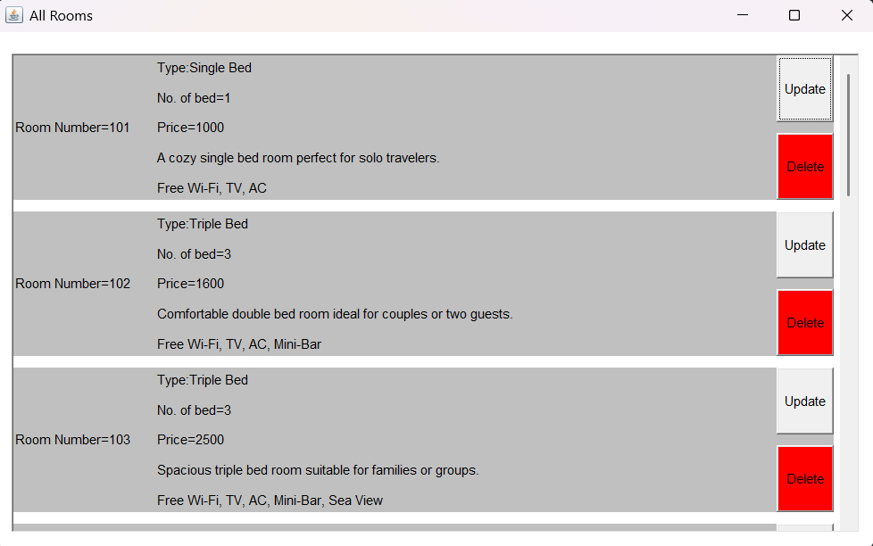
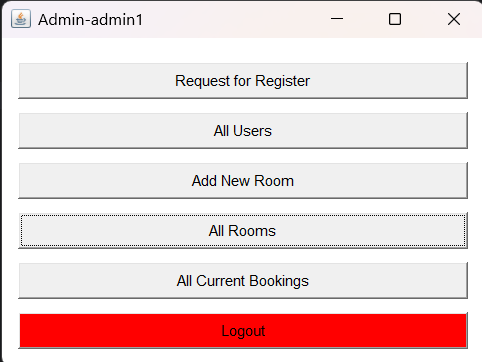
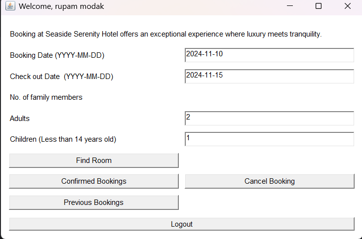
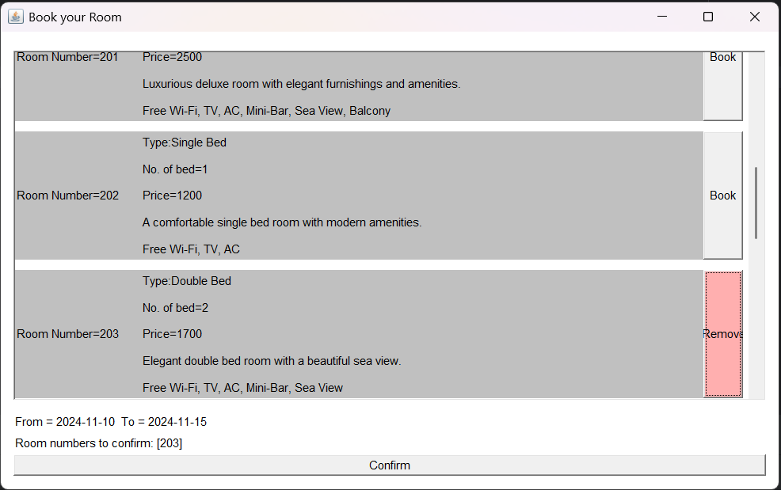

# 🌊🏨 Seaside Hotel Management System 🏨🌊

Welcome to the **Seaside Hotel Management System**! This project is a **Java-based application** that helps manage a seaside hotel's operations using a graphical user interface built with **AWT (Abstract Window Toolkit)**. It has separate functionalities for **Admins** and **Users** to handle bookings, room management, and more.

## 📑 Table of Contents
- [About the Project](#-about-the-project)
- [Features](#-features)
- [Technologies Used](#-technologies-used)
- [Installation & Setup](#-installation--setup)
- [Branch Structure](#-branch-structure)
- [Usage](#-usage)
- [Screenshots](#-screenshots)
- [Contributing](#-contributing)
- [License](#-license)

## 📌 About the Project
The **Seaside Hotel Management System** allows both **admins** and **users** to interact with the hotel system through a simple and intuitive user interface. This project uses **Java** for both frontend and backend, along with a **MySQL database** for data management.

## 🚀 Features
### Admin Section:
- **Add Room**: Add new rooms to the hotel's inventory.
- **View All Rooms**: Display a list of all available and booked rooms.
- **View All Users**: Display all registered users in the system.
- **Update/Delete Room**: Update room details or delete rooms.
  
### User Section:
- **Find Room**: Search for available rooms based on your preferences.
- **Current Booking**: Book a room and view current bookings.
- **Previous Booking**: View past bookings.
- **Cancel Booking**: Cancel an existing booking.

## 🛠️ Technologies Used
- **Java** (Frontend & Backend)
- **AWT (Abstract Window Toolkit)** for the user interface
- **MySQL** for database management
- **JDBC Driver** to connect Java to MySQL

## ⚙️ Installation & Setup
### Prerequisites
- Java JDK (version 8 or higher)
- MySQL Server
- MySQL Connector/J (JDBC Driver)

### Instructions
1. **Clone the Repository**:
   ```bash
   git clone https://github.com/yourusername/SeasideHotelManagement.git
   cd SeasideHotelManagement
# 📖 Usage
1. Admin:
    - Add or modify rooms, view all bookings, and manage users.
2. User:
    - Register or log in to book rooms, view current or past bookings, and cancel bookings if needed.
# 📸 Screenshots
1. 
2. 
3. 
4. 

# Branch Structure
 - This project uses a branching strategy to separate the frontend and backend code:
   - frontend: Contains all the frontend UI components.
   - backend: Contains all the backend logic for interacting with the database.